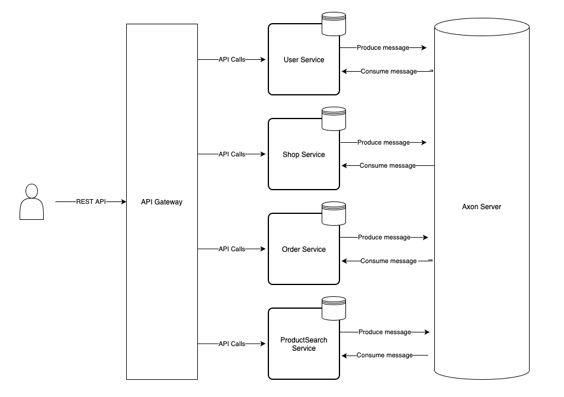

Sally project
=========================
Main goal of this project is to demonstrate best practises of building distributed system by implementing different 
approaches like Event Sourcing, Command Query Responsibility Segregation, SAGA and other microservice patterns using tools like Spring,
Axon Framework, Testcontainers, Elasticksearch, Google Kubernetes Engine, Cloud Build (as CI/CD).

Highlevel architecture
-------------------------------


Running on local
-------------------------------
For running into local machine use next command to pick everything up
```shell script
mvn clean install & docker-compose up
```    
NOTE: Elasticksearch may need additional memory. You can increse memory in docker setting. 
